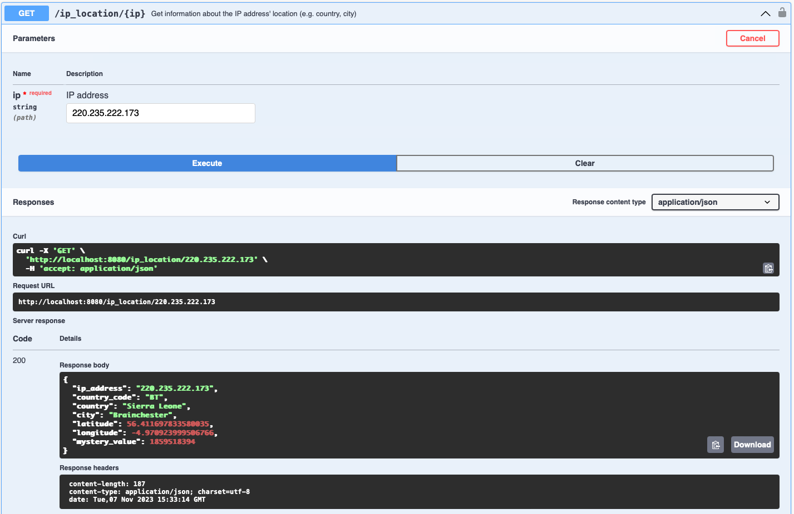

# VIO - FindHotel Coding Challenge

This project allows to import and access geolocation data over HTTP. The project has two main components:
1. `viodata` - library for importing, validating and accessing saved data (in the Database). [More about viodata](./viodata/README.md)
2. `vioapi` - application for using `viodata` as importer or as a datasource. [More about vioapi](./vioapi/README.md)


## How to run?
Ensure you've setup correctly `.env` environment variables. You can make it by copying `.env.example` file.

For running project you need to install docker-compose. Link: https://docs.docker.com/compose/install/

Once the docker-compose is installed you can execute following command in the root folder `vio`:
```
docker-compose up
```

This command will setup `importer` and `api` services as well as dependent services like: `postgreSQL`, `pgWeb` and `migration`.

Almost all components require to have `postgreSQL` ready first. Once it's ready `migrating` process will start to ensure that the schema of the database is correct. You can open `pgweb` page by following this link: `https://localhost:8081` and check the schema.

Importing process will start in parallel with serving api. Entire process of import can take a while depending on your docker configuration (like vCPU, vRAM, ect.) and local configuration of import. You can find this configuration in the `.env` file. 

There are two main configurations:
1. `COUNT_GO_ROUTINE` - define amount of concurrent goroutines that can handle (validate and insert) each row from imported file;
2. `COUNT_BULK_INSERT` - define maximum amount of `ip_location` entities that can be inserted in bulk operation to the database. There might be less entities in case when we rich the end of the imported file. Though `countries` will be inserted in the loop in order to generate IDs.

And one additional parameter in the docker-compose for database is `max_connections=1000` which describes maximum count of connections. By default is equal `100`, but has changed to `1000` to be more flexible with main configs. Exceeding the stated number will result in an error stating "too many clients already".

### Expected result:
An example of local configuration is from `.env.example` and setup: CPUs - 8, Memory - 16 GB(MacBook Pro 16 M1 PRO) importing result is:
```
{"importing_duration": "2m49.577327452s", "accepted_entries": 950076, "discarded_entries": 49924}
```

To access API follow the link: `https://localhost:8080/` it will automatically redirect to swagger documentation. API query `/ip_location/:ip`(type GET) is located at the same page with `IP Address` as an argument. By hitting `Try it out` the HTTP Request can be executed: 


## TODO:

- [ ] DATA | Investigate why first 4-8 countries can't be inserted without retry mechanism.
- [ ] Instead of linking `vioapi` to `viodata` by `replace github.com/stalko/viodata => ../viodata` in `go.mod` split it to independent repositories with access by GitHub access token;
- [ ] Split `vioapi` into two logical projects like `vioapi` and `vioimporter`. `vioapi` - will be responsible only for external access over HTTP and `vioimporter` will take care of importing CSV data;
- [ ] API  | Introduce pagination, if there are more then one result on getting `ip_location` by `IP Address`;
- [ ] DATA | Improve storing `country_code` and `city` fields by including `country_code` to `countries` table and `city` as additional table linked to `country` and `ip_locations`. Right now it's not implemented  as it slows down process of importing and due to incorrect data (for example country `Netherlands` can have different country code like `PA`, `MT`);
- [ ] DATA | Store geolocation data in geometry Point object(GIS) instead of two columns. It will simplify GEO-queries in the future. Right now database already supporting GIS extension and there is a query for getting and saving geometry object. But, it will slow down importing due to limitation of `copyfrom` feature usage;
- [ ] API  | Create Sentry project to improve logging in the production;
- [ ] API  | Define deadline for context of importing process. It might save resource time in case if something happens with a worker. Context already being used in `viodate` over all workers.

### Notes:
- Database normalization will slow down importing process. But it can be improved with additional "job" that will take care of additional keys creation when it's required.